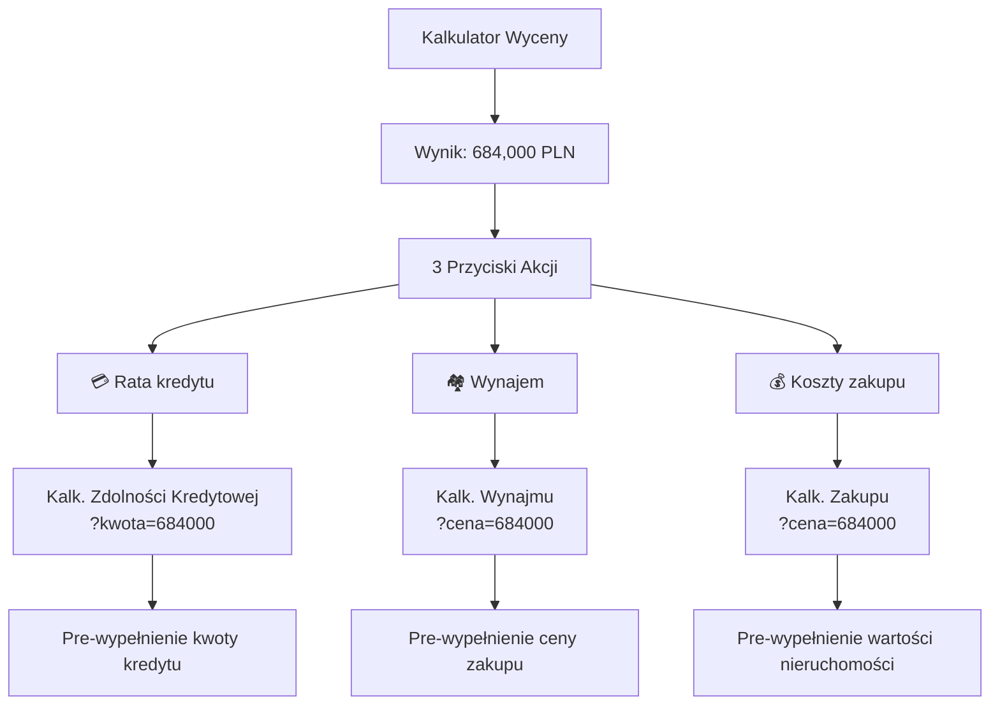

# Integracja Kalkulatorów - Dokumentacja

## Przegląd

System kalkulatorów nieruchomości oferuje płynną integrację między różnymi narzędziami poprzez propagację parametrów URL i pre-wypełnianie formularzy.

## Przepływ Użytkownika



## Implementacja Techniczna

### 1. Kalkulator Wyceny (`/kalkulator-wyceny`)

**Wyniki z linkami:**
```typescript
<Link href={`/kalkulator-zdolnosci-kredytowej?kwota=${result.price}`}>
  💳 Rata kredytu
</Link>
<Link href={`/kalkulator-wynajmu?cena=${result.price}`}>
  🏘️ Wynajem
</Link>
<Link href={`/kalkulator-zakupu-nieruchomosci?cena=${result.price}`}>
  💰 Koszty zakupu
</Link>
```

### 2. Kalkulator Zdolności Kredytowej

**Obsługa parametru `?kwota=`:**
```typescript
const searchParams = useSearchParams();
const initialLoanAmount = searchParams.get('kwota') || '';
const [loanAmount, setLoanAmount] = useState(initialLoanAmount);
```

**Wyświetlanie informacji:**
```tsx
{initialLoanAmount && (
  <span className="text-green-600 bg-green-100 px-2 py-1 rounded">
    💰 Kwota z kalkulatora wyceny: {parseInt(initialLoanAmount).toLocaleString('pl-PL')} zł
  </span>
)}
```

**Porównanie z zdolnością:**
```tsx
{loanAmount && parseFloat(loanAmount) > 0 && (
  <div className="mt-3 p-3 rounded-lg border">
    {parseFloat(loanAmount) <= (maxLoanAmount || 0) ? (
      <div className="text-green-600">
        ✅ Kredyt możliwy do uzyskania!
      </div>
    ) : (
      <div className="text-red-600">
        ❌ Przekracza zdolność o {(parseFloat(loanAmount) - (maxLoanAmount || 0)).toFixed(0)} zł
      </div>
    )}
  </div>
)}
```

### 3. Kalkulator Wynajmu

**Obsługa parametru `?cena=`:**
```typescript
const searchParams = useSearchParams();
const initialPrice = searchParams.get('cena') || '';
const [purchasePrice, setPurchasePrice] = useState(initialPrice);
```

**Wyświetlanie informacji:**
```tsx
{initialPrice && (
  <div className="mt-2 text-green-600 bg-green-100 px-3 py-1 rounded-lg inline-block">
    💰 Cena z kalkulatora wyceny: {parseInt(initialPrice).toLocaleString('pl-PL')} zł
  </div>
)}
```

### 4. Kalkulator Kosztów Zakupu

**Obsługa parametru `?cena=`:**
```typescript
const searchParams = useSearchParams();
const initialPrice = searchParams.get('cena') || '';
const [formData, setFormData] = useState<FormData>({
  propertyValue: initialPrice || '500000',
  // ...
});
```

**Wyświetlanie informacji:**
```tsx
{initialPrice && (
  <div className="mt-3 text-green-600 bg-green-100 px-3 py-2 rounded-lg inline-block">
    💰 Cena z kalkulatora wyceny: {parseInt(initialPrice).toLocaleString('pl-PL')} zł
  </div>
)}
```

## Parametry URL

| Kalkulator | Parametr | Opis | Przykład |
|------------|----------|------|----------|
| Zdolność Kredytowa | `kwota` | Pożądana kwota kredytu | `?kwota=684000` |
| Wynajem | `cena` | Cena zakupu nieruchomości | `?cena=684000` |
| Koszty Zakupu | `cena` | Wartość nieruchomości | `?cena=684000` |

## Przykłady Użycia

### Pełny przepływ użytkownika:

1. **Wycena mieszkania 60m² w Kortowie:**
   ```
   POST /api/valuation
   {"city":"Olsztyn","district":"Kortowo","area":60,"rooms":3,"floor":2,"year":2015}
   
   Wynik: 684,000 PLN
   ```

2. **Przejście do kalkulatora zdolności:**
   ```
   /kalkulator-zdolnosci-kredytowej?kwota=684000
   
   Pre-wypełnienie: Kwota kredytu = 684,000 zł
   ```

3. **Przejście do kalkulatora wynajmu:**
   ```
   /kalkulator-wynajmu?cena=684000
   
   Pre-wypełnienie: Cena zakupu = 684,000 zł
   ```

4. **Przejście do kalkulatora kosztów:**
   ```
   /kalkulator-zakupu-nieruchomosci?cena=684000
   
   Pre-wypełnienie: Wartość nieruchomości = 684,000 zł
   ```

## Korzyści UX

1. **Bezproblemowy przepływ** - użytkownik nie musi ponownie wprowadzać kwot
2. **Kontekst zachowany** - informacja skąd pochodzą dane
3. **Szybka analiza** - możliwość sprawdzenia różnych scenariuszy jednym kliknięciem
4. **Wizualne potwierdzenie** - kolorowe znaczniki pokazują źródło danych

## Walidacja i Fallback

- **Brak parametru**: Kalkulatory działają normalnie z pustymi polami
- **Nieprawidłowa wartość**: Parametry są walidowane i sanityzowane
- **Błędne formatowanie**: `parseInt()` i `parseFloat()` zapewniają bezpieczeństwo

## Metryki i Analytics

Każde przejście między kalkulatorami może być śledzone dla analizy ścieżek użytkownika:

```typescript
// Przykład śledzenia przejścia
trackEvent('calculator_navigation', {
  from: 'valuation',
  to: 'credit_capacity',
  amount: 684000
});
```

## Rozwój

### Planowane rozszerzenia:
- Propagacja większej liczby parametrów (lokalizacja, typ nieruchomości)
- Zapamiętywanie preferencji użytkownika
- Historia obliczeń i porównania scenariuszy
- Eksport wyników do PDF z pełnym przepływem 